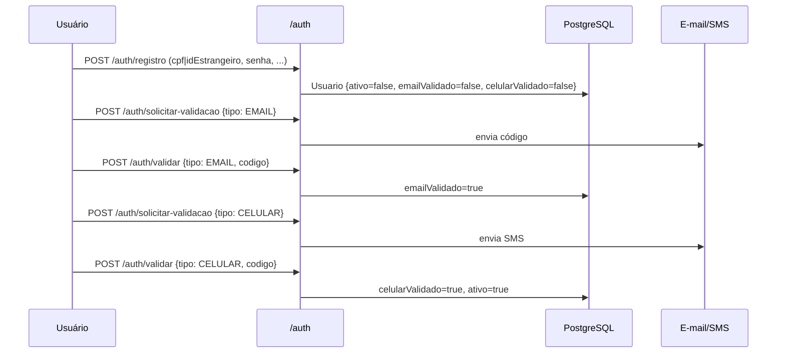
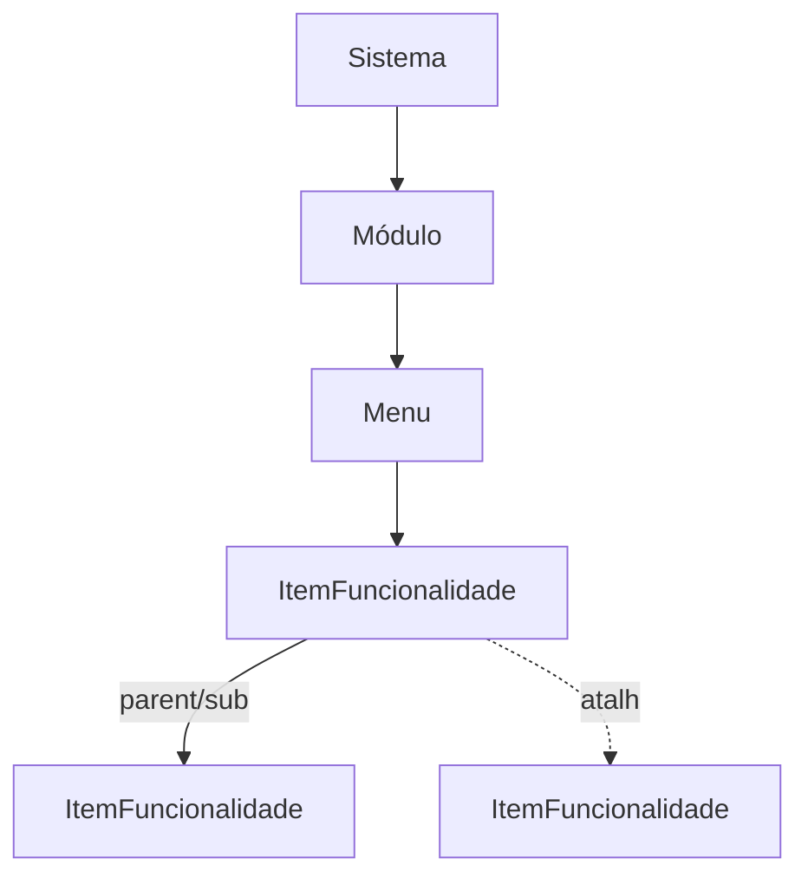

# Arquitetura do Gênesis

> Framework provedor de infraestrutura para aplicações satélites. Centraliza
> gestão de Sistemas, Módulos, Menus, Itens de Funcionalidade, Usuários,
> Permissões, Relatórios/Favoritos e o Plano de Contas Contábil.
> Este documento descreve o estado **atual** do código em `src/` e `prisma/`.

## 1. Visão Geral

O Gênesis expõe duas superfícies sobre a mesma instância Fastify:

1. **API REST JSON** (Bearer JWT) — consumida por sistemas satélites.
2. **Painel Admin HTML/HTMX** sob `/admin` — autenticado por cookie JWT,
   renderizado com EJS server-side e atualizações parciais via HTMX.

Ambas dividem o mesmo `app.ts`, os mesmos plugins e os mesmos services.
Não há frontend SPA: o painel é HTML renderizado no servidor.

## 2. Stack Tecnológica

| Camada            | Tecnologia                                       |
| ----------------- | ------------------------------------------------ |
| Runtime           | Node.js LTS (ESM, `"type": "module"`)            |
| Linguagem         | TypeScript strict                                |
| HTTP              | Fastify 5                                        |
| ORM               | Prisma 7 (`@prisma/adapter-pg`)                  |
| Banco             | PostgreSQL                                       |
| Autenticação      | `@fastify/jwt` (Bearer) + cookie (admin)         |
| Hash de senha     | Argon2                                           |
| Views (admin)     | `@fastify/view` + EJS + HTMX                     |
| Rate limiting     | `@fastify/rate-limit` (opt-in por rota)          |
| E-mail / SMS      | nodemailer / twilio                              |
| Testes            | Vitest (unit) + Playwright (e2e)                 |

## 3. Estrutura de Pastas

```
src/
├── app.ts              # Composição da aplicação Fastify (plugins + rotas)
├── server.ts           # Bootstrap: lê PORT/BASE_URL e dá listen
├── errors.ts           # ErroNegocio + tratarErro + statusDeErro
├── schemas.ts          # JSON Schema (Fastify-native) de body/params/query
├── plugins/            # prisma, jwt, cookie, formbody, view
├── routes/             # API REST JSON (sistemas, modulos, menus, ...)
├── services/           # Regras de negócio + acesso a dados (Prisma)
├── admin/              # Painel HTML (rotas + middleware de cookie)
└── views/              # Templates EJS do admin

prisma/
├── schema.prisma       # 19 modelos + 5 enums
├── migrations/
└── seed.ts
```

Diferenças deliberadas vs. uma Clean Architecture canônica:

- **Não há camada `repositories/` separada.** Cada Service recebe um
  `PrismaClient` no construtor e faz as queries diretamente. O Prisma já é a
  camada de acesso a dados; uma camada extra seria abstração especulativa.
- **Não há `controllers/` separados de `routes/`.** Arquivos em `src/routes/`
  registram handlers Fastify magros que delegam ao service correspondente.
- **Validação fica nos schemas Fastify (JSON Schema)**, não em Zod/Joi. Os
  blocos vivem em `src/schemas.ts` e são anexados via `{ schema: ... }` no
  registro da rota.

## 4. Composição da Aplicação

`src/app.ts` é a fonte da verdade da composição:

```
Fastify
  └─ prisma, jwt, cookie, formbody, view, rate-limit
  └─ GET /health
  └─ /admin/*                              (cookie auth, HTML)
  └─ /auth/*                               (público)
  └─ {context com hook onRequest=authenticate}
       └─ /sistemas, /modulos, /menus, /itens, /admins,
          /permissoes, /relatorios, /favoritos,
          /modelos-contabeis, /estados, /municipios,
          /planos-de-contas, /contas, /usuarios, /codigos
```

O bloco protegido é registrado dentro de um `app.register(async api => …)`
com `api.addHook('onRequest', app.authenticate)` — garantindo que qualquer
rota fora de `/auth/*` ou `/admin/*` exija JWT válido.

## 5. Autenticação e Autorização

### 5.1 JWT da API (Bearer)
- Emitido por `POST /auth/login` após verificação Argon2 da senha.
- Verificado em todo bloco protegido por `app.authenticate` (`src/plugins/jwt.ts`).
- Payload: `{ sub: usuarioId, email }`. Sem refresh token (escopo atual).

### 5.2 Cookie do Admin
- `genesis_admin_token` (HTTP-only) emitido por `/admin/login`.
- O middleware `adminAuthMiddleware` (em `src/admin/index.ts`) **re-checa em
  cada request**:
  - cookie válido (`jwt.verify`);
  - usuário tem `AdminSistema { ativo: true }`;
  - `emailValidado` e `usuario.ativo` ainda são `true`.
- Se qualquer estado regrediu (admin removeu vínculo, e-mail foi
  desvalidado etc.), o cookie é limpo e o usuário é redirecionado — sessões
  não sobrevivem a mudanças no banco.

### 5.3 Autorização por recurso
- `services/autorizacao.ts` expõe `assertAdminSistema` / `assertAdminModulo`,
  usados pelos services antes de qualquer mutação sensível.
- **Hard rule:** ao criar um Sistema, o `adminUsuarioId` é forçado para
  `req.user.sub` no controller (`src/routes/sistemas.ts`) — impede que um
  usuário designe terceiros como admin inicial.

### 5.4 Cadastro e ativação
Fluxo de duas etapas obrigatórias (regra de negócio do CLAUDE.md):



Códigos vivem em `CodigoValidacao` com `expiradoEm`, `tentativas` e
`usadoEm`. Senhas são armazenadas como `senhaHash` (Argon2). `camposPublicos`
em `services/auth.ts` define o `select` seguro — `senhaHash` nunca é
retornado.

## 6. Modelo de Dados

### 6.1 Hierarquia de navegação (núcleo Gênesis)



- `ItemFuncionalidade.tipo`: `FUNCIONALIDADE | SUBMENU`.
- Quando `FUNCIONALIDADE`: `tipoFuncionalidade ∈ {CRUD, TELA, RELATORIO}`.
- `parentId` aponta para outro item do mesmo menu (submenus em árvore).
- `referenciaId` cria **atalhos** para um item existente (mesmo target,
  outra posição no menu).
- IDs são UUIDv4 em todos os modelos.

### 6.2 Administração e permissões

| Modelo            | Constraint chave                | Função                                  |
| ----------------- | ------------------------------- | --------------------------------------- |
| `AdminSistema`    | `@@unique([usuarioId, sistemaId])` | Vínculo admin ↔ sistema             |
| `AdminModulo`     | `@@unique([usuarioId, moduloId])`  | Vínculo admin ↔ módulo              |
| `PermissaoAcesso` | nível por item                  | `VISUALIZAR / CRIAR / EDITAR / EXCLUIR / TOTAL` |

**Trava de admin:** o último administrador ativo de um Sistema ou Módulo
não pode ser removido (verificado nos services antes do `delete`).

### 6.3 Lixeira (soft delete)

`SistemasService.excluir`, `ModulosService.excluir` etc. usam
`LixeiraService` para serializar a entidade e seus filhos como `Json` em
`Lixeira { tipo, nome, estrutura, excluidoEm, excluidoPorId }`. A exclusão
em si é hard delete, em transação, mas a estrutura fica recuperável.

### 6.4 Favoritos

`PastaFavorito` é auto-relacionada (`parentId`/`subPastas`) — replica a
experiência de favoritos do Chrome (pastas e subpastas). `FavoritoItem`
favorita uma funcionalidade; `FavoritoRelatorio` favorita um relatório
fixo **ou** personalizado (XOR via campos nullable).

### 6.5 Módulo Contábil

```
ModeloContabil
  ├─ Estado (modeloContabilId opcional → herança por UF)
  ├─ Municipio (modeloContabilId opcional → override por município)
  └─ PlanoDeContas (1 por modelo × ano)
       └─ Conta (árvore até 7 níveis — casa com o PCASP Estendido oficial)
            └─ Lancamento (partida dobrada, escopo município)
                 └─ LancamentoItem
            └─ ResumoMensalConta (agregação cacheada)
            └─ SaldoInicialAno (populado na virada de ano)
```

## 7. Padrões de Código

### 7.1 Service — formato canônico

```ts
export class XService {
  constructor(private prisma: PrismaClient) {}

  async criar(dados: CriarX) {
    try {
      return await this.prisma.$transaction(async tx => {
        const x = await tx.x.create({ data: dados })
        // efeitos colaterais atômicos no mesmo tx
        return x
      })
    } catch (e) {
      if (e instanceof Prisma.PrismaClientKnownRequestError && e.code === 'P2002') {
        throw new ErroNegocio('CONFLITO', 'Já existe X com esse nome.')
      }
      throw e
    }
  }
}
```

Regras:
- Toda mutação que toca mais de uma tabela vai em `$transaction`.
- Códigos Prisma traduzidos: `P2002 → CONFLITO`, `P2025 → RECURSO_NAO_ENCONTRADO`.
- Erros de domínio sempre via `throw new ErroNegocio(code, mensagem)`.

### 7.2 Rota REST — formato canônico

```ts
app.post('/sistemas', { schema: sCriarSistema }, async (req, reply) => {
  try {
    const sistema = await service.criar({ ...req.body, adminUsuarioId: req.user.sub })
    return reply.status(201).send({ data: sistema })
  } catch (e) {
    return tratarErro(e, reply)
  }
})
```

- **Validação:** JSON Schema em `src/schemas.ts`, anexado via `{ schema }`.
- **Respostas:** sempre envelopadas em `{ data: ... }` (sucesso) ou
  `{ error: { code, message } }` (falha).
- **Erros:** `tratarErro` mapeia `ErroNegocio` → HTTP via `statusDeErro`,
  e re-lança qualquer outra coisa para o error handler default do Fastify.

| `code`                    | HTTP |
| ------------------------- | ---- |
| `REQUISICAO_INVALIDA`     | 400  |
| `NAO_AUTENTICADO`         | 401  |
| `NAO_AUTORIZADO`          | 403  |
| `RECURSO_NAO_ENCONTRADO`  | 404  |
| `CONFLITO`                | 409  |
| `ENTIDADE_NAO_PROCESSAVEL`| 422  |
| (qualquer outro)          | 500  |

### 7.3 Painel Admin
- Rotas em `src/admin/<recurso>.ts` retornam HTML completo (layout EJS) ou
  fragmentos parciais (HTMX).
- Hook em `src/admin/index.ts` impede que URLs de fragmentos sejam abertas
  diretamente no browser: requisição GET sem header `hx-request` cujo path
  tem ≥2 segmentos é redirecionada para `/admin`.
- Templates ficam em `src/views/<recurso>/` com layouts compartilhados em
  `src/views/layouts/`.

## 8. Migrações

- Schema vive em `prisma/schema.prisma`. Mudanças sempre via
  `npm run db:migrate` (`prisma migrate dev`). Nunca SQL ad-hoc no banco.
- `prisma/seed.ts` popula dados iniciais.

## 9. Testes

- **Unit / integração leve:** Vitest em `src/**/__tests__/` (`npm test`).
  Cobertura via `npm run test:coverage`. Objetivo do projeto: ≥ 100% de
  branches nos services e routes ativos (commits recentes documentam o
  fechamento das lacunas).
- **End-to-end:** Playwright em `e2e/` (`npm run test:e2e`).

## 10. Variáveis de Ambiente

| Variável         | Obrigatória               | Função                                 |
| ---------------- | ------------------------- | -------------------------------------- |
| `DATABASE_URL`   | sempre                    | Conexão PostgreSQL (Prisma)            |
| `JWT_SECRET`     | sempre                    | Assinatura dos JWT                     |
| `BASE_URL`       | em produção               | Usada em links de ativação por e-mail  |
| `PORT`           | opcional (default 3000)   | Porta do servidor                      |
| `NODE_ENV`       | opcional                  | `production` ativa checagens extras    |
| SMTP / Twilio    | conforme `services/email.ts` e `sms.ts` | Envio de códigos     |

`server.ts` aborta o boot em produção se `BASE_URL` não estiver definida.

## 11. Convenções e Regras Estritas

1. **UUID** em todos os IDs primários — nunca `autoincrement()`.
2. **Transações** em qualquer operação que cria/exclui hierarquia
   (Sistema com admin inicial, exclusão em cascata com lixeira, etc.).
3. **Trava de admin ativo:** services impedem remoção do último admin.
4. **Identificação única:** Usuário tem CPF **ou** ID estrangeiro, nunca
   ambos; CPF validado via dígitos verificadores em `services/auth.ts`.
5. **Senha:** Argon2; campo `senhaHash` jamais entra em `select`/`return`.
6. **Erros:** sempre `ErroNegocio` no domínio, `tratarErro` na rota.
   Nada de `try/catch` engolindo no controller, nada de `throw 500` cru.
7. **Validação:** JSON Schema em `src/schemas.ts`, plugado via `{ schema }`.
8. **Migrações:** apenas via Prisma Migrate.
